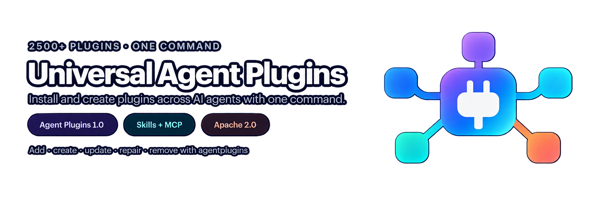

[](https://github.com/777genius/universal-agent-plugins/actions/workflows/ci.yml)
[](https://github.com/777genius/universal-agent-plugins/releases)
[](https://www.npmjs.com/package/universal-agent-plugins)
[](https://agent-plugins.org/specification)
[](LICENSE)

Install and manage Agent Plugins 1.0 across your AI agents with one CLI.

## Use plugins

### Quick start

Choose your operating system and run the commands below.

<details>
<summary><strong>macOS</strong></summary>

With Homebrew:

```bash
brew install 777genius/agentplugins/agentplugins
agentplugins add context7
```

Without Homebrew, use the native installer:

```bash
curl -fsSL https://raw.githubusercontent.com/777genius/universal-agent-plugins/main/install.sh | sh -s -- add context7
```

</details>

<details>
<summary><strong>Linux</strong></summary>

Install the matching native binary and add your first plugin:

```bash
curl -fsSL https://raw.githubusercontent.com/777genius/universal-agent-plugins/main/install.sh | sh -s -- add context7
```

Homebrew also works on Linux: run `brew install 777genius/agentplugins/agentplugins`,
then `agentplugins add context7`.

</details>

<details>
<summary><strong>Windows</strong></summary>

Run in PowerShell:

```powershell
irm https://raw.githubusercontent.com/777genius/universal-agent-plugins/main/install.ps1 | iex
& "$HOME\.local\bin\agentplugins.exe" add context7
```

</details>

<details>
<summary><strong>Any OS with Node.js 22+ (npx)</strong></summary>

Run on a supported desktop OS without permanently installing the CLI:

```bash
npx universal-agent-plugins add context7
```

</details>

The CLI finds compatible agents installed on your computer.

1. Choose one or more agents if prompted. If only one is found, it is selected automatically.
2. Follow any activation or sign-in instructions printed by the CLI.
3. Start a new agent session and try the plugin.

<details>
<summary>Installation details</summary>

Homebrew and the installers select the native binary for your OS and architecture.
The installer scripts verify its published SHA-256 and reported version, then
replace the CLI atomically. They install into `$HOME/.local/bin` unless
`AGENTPLUGINS_BIN_DIR` is set.

The native CLI does not require Node.js. The `npx` option requires Node.js 22+
and downloads and runs the verified Go binary. Individual plugins may have
their own runtime requirements, which the CLI checks before installation.

The plugin package is downloaded and verified once, then prepared for each
selected agent.

</details>

[Browse plugins](https://777genius.github.io/universal-agent-plugins/plugins/)

## What the CLI does

- installs one plugin in one or several supported agents;
- updates, repairs, and removes only files it manages;
- converts the same Agent Plugins 1.0 package into each agent's native format;
- keeps activation and OAuth prompts visible to you.

## Any Agent Plugins 1.0 package

The installed package is standard-first:

```text
plugin.json
├── skills/       optional reusable instructions
└── mcp.json      optional MCP servers
```

You can also install a local package or a pinned GitHub package without adding
it to the registry. Direct-install examples are collected near the end of this
README.

plugin.yaml is the legacy plugin-kit-ai authoring format. It is not merged with
or allowed to override plugin.json.

## Supported clients

The CLI has adapters for:

| Client | Delivery |
| --- | --- |
|  Codex | managed package or OpenAI compatibility package |
|  ChatGPT | registered app/binding where the package provides one |
|  Cursor | native Agent Plugin and MCP/skills projection |
|  GitHub Copilot CLI | native plugin and managed marketplace path |
|  VS Code | prepared Copilot-compatible package |
|  Kiro | native folder and Power import guidance |
|  Claude Code | client-specific skills/MCP projection |
|  Gemini CLI | client-specific configuration projection |
| <picture><source media="(prefers-color-scheme: dark)" srcset="assets/client-icons/opencode-dark.svg"></picture> OpenCode | client-specific configuration projection |
| <picture><source media="(prefers-color-scheme: dark)" srcset="assets/client-icons/cline-dark.svg"></picture> Cline | client-specific configuration projection |
| <picture><source media="(prefers-color-scheme: dark)" srcset="assets/client-icons/windsurf-dark.svg"></picture> Windsurf | client-specific configuration projection |

Compatibility is package-specific. A schema pass means that the package is
well-formed; it does not prove runtime, OAuth, or activation in every client.
The CLI prints installed, prepared, activation required, and authentication
pending as separate outcomes.

See the [client compatibility evidence](https://777genius.github.io/universal-agent-plugins/docs/en/reference/client-compatibility.html)
for tested client versions, platforms, and release-specific limitations.

For Codex, declared MCP SSE is unsupported; stdio and Streamable HTTP retain
their existing adapter support. Valid SSE components are excluded from Codex
delivery without invalidating the package. See [transport evidence and lifecycle
behavior](docs/CODEX_TRANSPORT_EVIDENCE.md).

## Find and verify plugins

search combines the reviewed Registry Directory with a signed public Discovery
Index containing conformant package paths. Discovery records are
unreviewed metadata, not endorsements. They install only through a
publisher-qualified exact-SHA selector and are validated again before mutation.

The registry is optional for direct installs, but it makes reviewed short names,
provenance, compatibility notes, and safe discovery convenient:

[Browse the registry](https://777genius.github.io/universal-agent-plugins/plugins/) ·
[Submit a package](https://github.com/777genius/universal-agent-plugins-registry/blob/main/CONTRIBUTING.md)

## Lifecycle safety

Before changing a client, the CLI validates the source and preflights every
selected target. --dry-run prints the same plan without writing. Managed files
and state are committed together; failures roll back what ownership proves safe
or stop with a repair command. OAuth and consent remain visible and controlled
by you. No install telemetry is sent.

The CLI is an independent community project. It is not affiliated with OpenAI,
Agent Plugins, or the vendors shown above.

## More commands

For normal interactive use, omit `--target` and choose agents in the prompt.
Use `--target` in scripts, CI, or whenever you want to name clients explicitly.

```bash
# Find and inspect plugins
agentplugins search docs
agentplugins info context7

# Install in specific agents
agentplugins add context7 --target codex,cursor,kiro

# Manage an installed plugin
agentplugins update context7 --target codex,cursor
agentplugins repair context7 --target codex,cursor
agentplugins remove context7 --target codex,cursor
agentplugins outdated --all
agentplugins update --all
agentplugins doctor

# Install a local Agent Plugins 1.0 package
agentplugins validate ./my-plugin
agentplugins add ./my-plugin

# Install the only Agent Plugins package found at an exact commit
agentplugins add \
  owner/repository@0123456789abcdef0123456789abcdef01234567

# Choose a package explicitly when a repository contains several
agentplugins add \
  owner/repository@0123456789abcdef0123456789abcdef01234567//path/to/plugin
```

Remote installs require a full 40-character commit SHA. Branches, tags, and
abbreviated SHAs are rejected. When no package path is given, the CLI uses a
valid root `plugin.json` or auto-selects the only valid nested package that has
`mcp.json` or `skills/`. If several packages match, it lists them and asks for
an explicit `//path`. Repositories with more than 16 possible packages require
an explicit path before candidate packages are fetched. The selected canonical
path and package digest are stored for safe replay. Direct full-SHA installations
remain immutable; use `switch` to move to another exact source. `repair` reapplies
the recorded source, and `remove` changes only files owned by the CLI.

<a id="authoring-and-development"></a>

## Build plugins

Build portable Agent Plugins 1.0 packages around `plugin.json`, with optional
`skills/` and `mcp.json`. See the [Agent Plugins 1.0 specification](https://agent-plugins.org/specification)
and the [Use / Build quickstart](https://777genius.github.io/universal-agent-plugins/docs/en/guide/quickstart.html).

**Preparation — unreleased:** the standard-first authoring CLI is not released.
As checked on 2026-09-07, npm `universal-agent-plugins` is 0.1.53 and the stable
GitHub release is `agentplugins-v0.1.53`. npm/PyPI `plugin-kit-ai` is 1.2.4:
`plugin-kit-ai@latest` is the historical v1 tool, not standard-first v2.

For existing v1 `plugin.yaml` projects, retain the original templates, generation,
validation and export workflows in [the historical authoring guide](docs/PLUGIN_KIT_AI_AUTHORING.md).
The reference below is for historical v1 maintenance.

<details>
<summary>Legacy authoring and SDK reference</summary>

`plugin-kit-ai` keeps authored source under `plugin/`, generates the supported outputs you need, and helps you validate the repo before handoff. This includes supported outputs for Claude, Codex, Gemini, Cursor, and OpenCode where the repo shape allows it. The honest promise is `one repo / many supported outputs`, not fake parity everywhere.

overview: [plugin-kit-ai documentation](https://777genius.github.io/universal-agent-plugins/docs/en/)
Use / Build and historical v1 maintenance: [Quickstart](https://777genius.github.io/universal-agent-plugins/docs/en/guide/quickstart.html)
historical v1 template selection: [Choose What You Are Building](https://777genius.github.io/universal-agent-plugins/docs/en/guide/choose-what-you-are-building.html)
one repo, many outputs: [What You Can Build](https://777genius.github.io/universal-agent-plugins/docs/en/guide/what-you-can-build.html)
honest caveat: [Support Boundary](https://777genius.github.io/universal-agent-plugins/docs/en/reference/support-boundary.html)

### Legacy quick start

```bash
brew install 777genius/homebrew-plugin-kit-ai/plugin-kit-ai
```

npm: `npm i -g plugin-kit-ai` or `npx plugin-kit-ai@latest ...`

pipx (`public-beta`, only when that release is published to PyPI): `pipx install plugin-kit-ai`

fallback installer: `curl -fsSL https://raw.githubusercontent.com/777genius/plugin-kit-ai/main/scripts/install.sh | sh`

```bash
plugin-kit-ai init my-plugin --template online-service
plugin-kit-ai init my-plugin --template local-tool
plugin-kit-ai init my-plugin --template custom-logic
plugin-kit-ai init my-plugin
plugin-kit-ai generate .
plugin-kit-ai validate . --platform codex-runtime --strict
```

### Support and references

[examples/starters/README.md](examples/starters/README.md)
[examples/local/README.md](examples/local/README.md)
[docs/CHOOSING_HELPER_DELIVERY_MODE.md](docs/CHOOSING_HELPER_DELIVERY_MODE.md)
the stable local Python and Node subset on `codex-runtime` and `claude`
`doctor`, `bootstrap`, `validate --strict`, `export`, and bundle handoff for that stable local subset
`generate`, `import`, and `normalize` are still `public-beta`
[docs/generated/target_support_matrix.md](docs/generated/target_support_matrix.md)
[docs/generated/support_matrix.md](docs/generated/support_matrix.md)
[docs/SUPPORT.md](docs/SUPPORT.md)

### SDK and CLI

Go SDK packages: `github.com/777genius/plugin-kit-ai/sdk/claude`, `github.com/777genius/plugin-kit-ai/sdk/codex`, and `github.com/777genius/plugin-kit-ai/sdk/gemini`.

```bash
./bin/plugin-kit-ai doctor ./my-plugin
./bin/plugin-kit-ai bootstrap ./my-plugin
./bin/plugin-kit-ai import ./native-plugin --from codex-runtime
./bin/plugin-kit-ai capabilities --format json
```

`plugin-kit-ai validate --format json` now emits the versioned `plugin-kit-ai/validate-report` contract.
[docs/CODEX_TARGET_BOUNDARY.md](docs/CODEX_TARGET_BOUNDARY.md)
[docs/VALIDATE_JSON_CONTRACT.md](docs/VALIDATE_JSON_CONTRACT.md)

</details>

Contributor checks:

```bash
go test ./...
make vet
```

- Contributing: [CONTRIBUTING.md](CONTRIBUTING.md)
- Security policy: [SECURITY.md](SECURITY.md)
- Support boundary: [docs/SUPPORT.md](docs/SUPPORT.md)
- Native CLI installation: [docs/NATIVE_INSTALL.md](docs/NATIVE_INSTALL.md)
- Client E2E evidence: [docs/AGENTPLUGINS_CLIENT_E2E.md](docs/AGENTPLUGINS_CLIENT_E2E.md)
- Registry repository: https://github.com/777genius/universal-agent-plugins-registry

## License

Universal Agent Plugins is licensed under the [Apache License 2.0](LICENSE).
Third-party components retain their original licenses; see [NOTICE](NOTICE) for
attribution.
