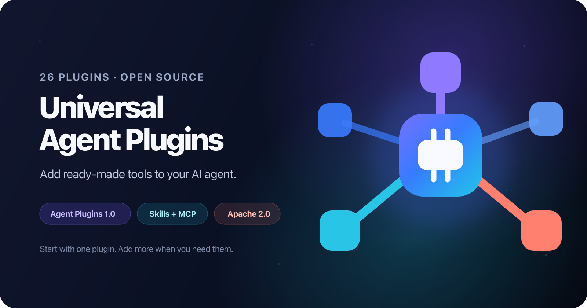

# Universal Agent Plugins

[](https://github.com/777genius/universal-agent-plugins/actions/workflows/validate.yml)
[](https://github.com/777genius/universal-agent-plugins/actions/workflows/live-e2e.yml)
[](https://agent-plugins.org/specification)
[](LICENSE)

Give your AI agent ready-made abilities: search current documentation, navigate
code, debug browsers, work with cloud tools, and more. Pick one plugin and add
others only when you need them.

This repository contains 26 open-source plugins packaged for the
[Agent Plugins 1.0](https://agent-plugins.org/specification) standard.

## Try one plugin

Context7 is an easy first choice. It finds up-to-date library documentation and
requires no account. With a current Codex CLI and Node.js installed, run:

```bash
codex plugin marketplace add 777genius/universal-agent-plugins --ref v0.1.1
codex plugin add context7@universal-agent-plugins
```

Open a new Codex session and ask:

```text
Use Context7 to find the current Playwright quick start and summarize it with source links.
```

That's it. Every plugin is independent, so you never need to install the whole
catalog or follow a chain of plugins.

Not using Codex? Choose Cursor, Kiro, ChatGPT, VS Code, or GitHub Copilot in the
[client setup guide](docs/QUICKSTART.md).

## Popular choices

| Plugin | What it adds | Login |
| --- | --- | --- |
| [`context7`](plugins/context7) | Current library documentation | No |
| [`agent-code-navigator`](plugins/agent-code-navigator) | Code search and architecture skills | No |
| [`cloudflare-docs`](plugins/cloudflare-docs) | Cloudflare documentation search | No |
| [`chrome-devtools`](plugins/chrome-devtools) | Browser debugging tools | Local browser |

Each one installs separately. See [plugins to try first](docs/HERO_PLUGINS.md)
for copy-ready examples, or browse all 26 packages in [`plugins/`](plugins).

## Use them with your agent

Agent Plugins 1.0 gives every package a shared structure. Compatible clients can
reuse the parts they support, while installation, permissions, and OAuth remain
client-specific.

| Client | Context7 check |
| --- | --- |
| Codex | Public marketplace install and real tool call |
| Cursor | Local plugin load |
| Kiro | Folder import |

All 26 packages pass the standard schemas. That does not mean every service or
OAuth flow has been tested in every client, and the standard is not a universal
marketplace. See the [test matrix](docs/TEST_MATRIX.md) for exact results and the
[compatibility guide](docs/COMPATIBILITY.md) before connecting a private service.

## Safety

- Review a plugin's tools and scopes before enabling it.
- Start with read-only tasks, especially after OAuth.
- Never place tokens in `plugin.json`, `mcp.json`, or committed headers.
- A valid package can still expose destructive tools.

See [SECURITY.md](SECURITY.md) for reporting and security boundaries.

## About this project

This repository rebuilds the portable subset of
[`universal-plugins-for-ai-agents`](https://github.com/777genius/universal-plugins-for-ai-agents)
without `plugin-kit-ai` as its authoring layer. Contributions are welcome; see
[CONTRIBUTING.md](CONTRIBUTING.md).

This is an independent community project maintained by 777genius. It is not
affiliated with or endorsed by OpenAI or the vendors represented in the catalog.
Original project material is licensed under [Apache 2.0](LICENSE).
