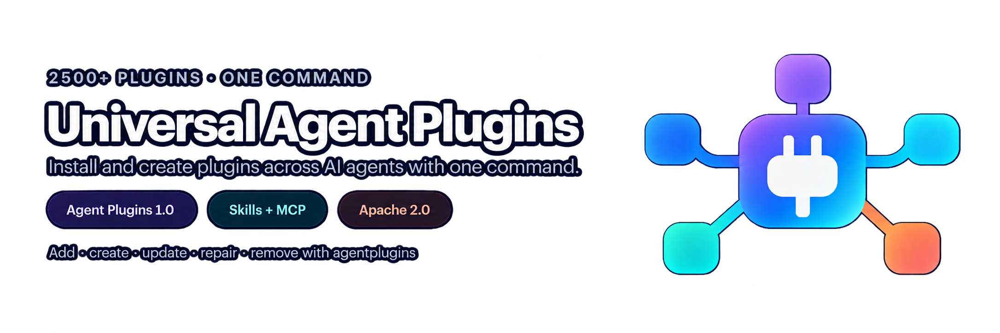
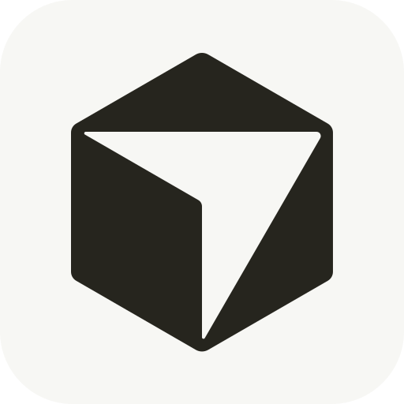
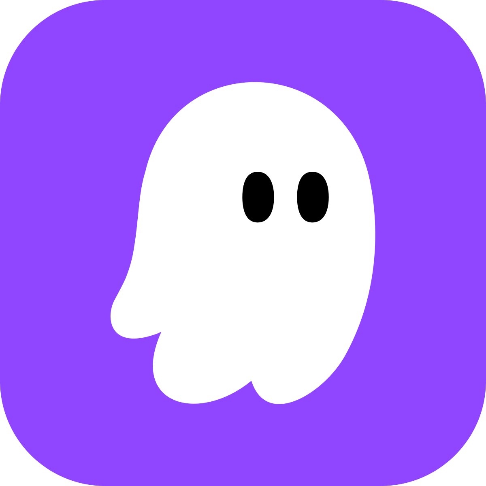
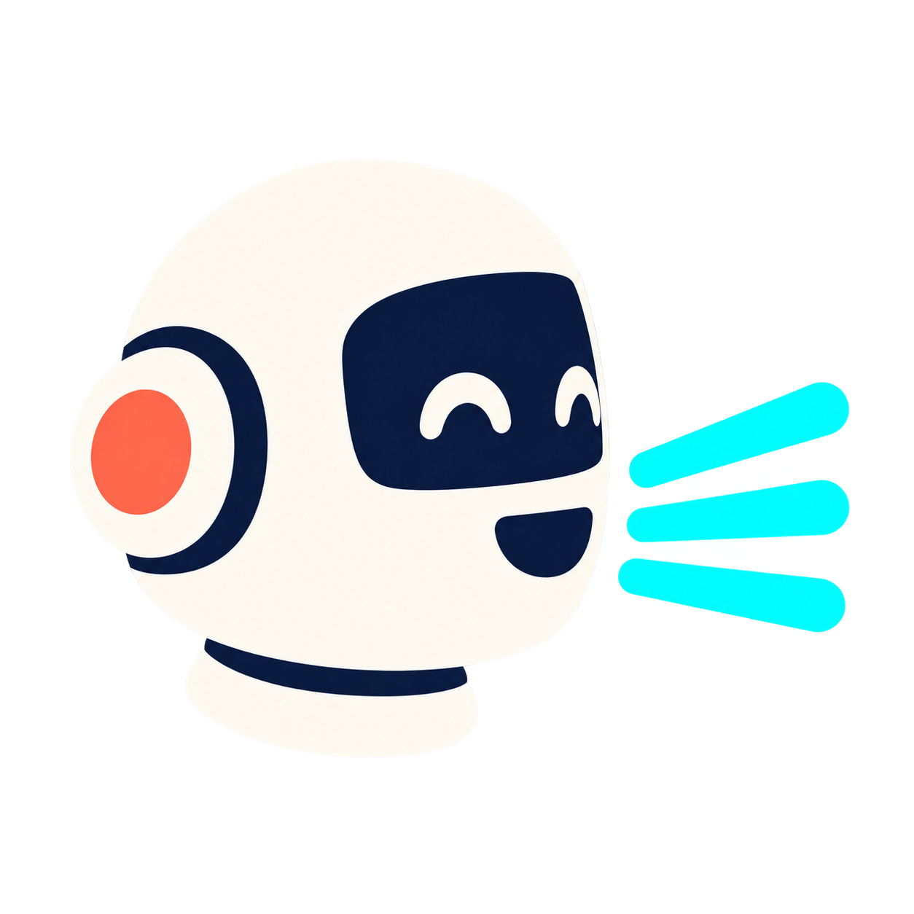

[](https://github.com/777genius/universal-agent-plugins/actions/workflows/ci.yml)
[](https://codecov.io/gh/777genius/universal-agent-plugins)
[](https://github.com/777genius/universal-agent-plugins/releases)
[](https://www.npmjs.com/package/universal-agent-plugins)
[](https://agent-plugins.org/specification)
[](LICENSE)

Install and manage Agent Plugins 1.0 across your AI agents with one CLI.

Our [installer automation principle](docs/INSTALLER_AUTOMATION_PRINCIPLE.md) is to complete every ownership-safe client step automatically and ask the user only for genuine external approvals, authentication, or reloads.

[Read the documentation](https://777genius.github.io/universal-agent-plugins/docs/en/) ·
[Browse plugins](https://777genius.github.io/universal-agent-plugins/plugins/)


## Use plugins

Install, inspect, update, repair, and remove packages with the existing installer.
The [Use guide source](website/source/en/use/index.md) collects this journey.
See [Build plugins](#build-plugins) below to create and check a package.

### Quick start

With Node.js 22+, run:

```bash
npx universal-agent-plugins add context7
```

The CLI automatically finds compatible agents, including Codex and Claude Code.
Choose agents if several are found; a single detected agent is selected automatically.
Follow the printed setup steps, then start a new agent session.

<details>
<summary>Other installation options</summary>

<details>
<summary><strong>macOS</strong></summary>

With Homebrew:

```bash
brew install 777genius/agentplugins/agentplugins
agentplugins add context7
```

Without Homebrew, use the native installer:

```bash
curl -fsSL https://raw.githubusercontent.com/777genius/universal-agent-plugins/main/install.sh | sh -s -- add context7
```

</details>

<details>
<summary><strong>Linux</strong></summary>

Install the matching native binary and add your first plugin:

```bash
curl -fsSL https://raw.githubusercontent.com/777genius/universal-agent-plugins/main/install.sh | sh -s -- add context7
```

Homebrew also works on Linux: run `brew install 777genius/agentplugins/agentplugins`,
then `agentplugins add context7`.

</details>

<details>
<summary><strong>Windows</strong></summary>

Run in PowerShell:

```powershell
irm https://raw.githubusercontent.com/777genius/universal-agent-plugins/main/install.ps1 | iex
& "$HOME\.local\bin\agentplugins.exe" add context7
```

</details>

To install the latest installer globally with Node.js 22+:

```bash
npm install -g universal-agent-plugins
```

Homebrew and the installers select the native binary for your OS and architecture.
The installer scripts verify its published SHA-256 and reported version, then
replace the CLI atomically. They install into `$HOME/.local/bin` unless
`AGENTPLUGINS_BIN_DIR` is set.

The native CLI does not require Node.js. The `npx` option requires Node.js 22+
and downloads and runs the verified Go binary. Individual plugins may have
their own runtime requirements, which the CLI checks before installation.

The plugin package is downloaded and verified once, then prepared for each
selected agent.

</details>

[Browse plugins](https://777genius.github.io/universal-agent-plugins/plugins/)

## What the CLI does

- installs one plugin in one or several supported agents;
- updates, repairs, and removes only files it manages;
- converts the same Agent Plugins 1.0 package into each agent's native format;
- keeps activation and OAuth prompts visible to you.

## Any Agent Plugins 1.0 package

Install from the registry, a local folder, or a GitHub repository pinned to an
exact commit. `plugin.json` is the sole supported authoring manifest.

<details>
<summary>Package layout and portability</summary>

The installed package is standard-first:

```text
plugin.json
├── skills/       optional reusable instructions
├── mcp.json      optional MCP servers
└── hooks/        optional client-specific extension
```

Skills and MCP are portable components. Hooks and other client-specific
extensions depend on the target client; they do not imply portable behavior.

You can also install a local package or a pinned GitHub package without adding
it to the registry. Direct-install examples are collected near the end of this
README.

Other manifest formats are ignored and cannot override `plugin.json`.

</details>

## Supported clients

The CLI has adapters for:

| Client | Delivery |
| --- | --- |
|  Codex | plugin package prepared for Codex |
|  ChatGPT | app setup; Context7 includes guided personal setup (Developer Mode and custom apps required) |
|  Cursor | native plugin with skills and MCP servers |
|  GitHub Copilot CLI | native plugin installed through a managed marketplace |
|  VS Code | plugin package prepared for Copilot |
|  Kiro | skills and MCP setup; OAuth/restart may be required |
|  Claude Code | native Claude Code plugin installation |
|  Gemini CLI | skills and MCP configuration |
| <picture><source media="(prefers-color-scheme: dark)" srcset="assets/client-icons/opencode-dark.svg"></picture> OpenCode | skills and MCP configuration |
| <picture><source media="(prefers-color-scheme: dark)" srcset="assets/client-icons/cline-dark.svg"></picture> Cline | skills and MCP configuration |
| <picture><source media="(prefers-color-scheme: dark)" srcset="assets/client-icons/windsurf-dark.svg"></picture> Windsurf | MCP configured; skills prepared for manual use |
|  Grok Build | native skills/MCP plugin; Grok CLI install and verification when available |
|  Kimi Code | native skills/MCP plugin and managed user registry; reload required |

Grok Build and Kimi Code accept automatic user-scope installation of portable skills and stdio/HTTP MCP servers through `agentplugins add ./my-plugin --target grok,kimi`. The CLI verifies native registration and supports update and removal. A running client still needs a reload, and remote MCP authentication/connectivity is verified in that client. Agent, hook, command, and LSP components are outside these two adapters' current supported scope.

Compatibility depends on the package and client. The CLI tells you what is
installed, prepared, or still needs activation or sign-in.

See the [client compatibility evidence](https://777genius.github.io/universal-agent-plugins/docs/en/reference/client-compatibility.html)
for tested client versions, platforms, and release-specific limitations.

<details>
<summary>Context7 setup for ChatGPT and Kiro</summary>

```bash
npx universal-agent-plugins add context7 --target chatgpt,kiro
```

- ChatGPT: the CLI guides you to create a Developer Mode app for
  `https://mcp.context7.com/mcp` with **No authentication**, accepts the
  resulting `asdk_app_...` ID, and prepares a personal marketplace package.
  You still install that package and select Context7 in a new chat. When other
  clients are selected too, the CLI installs them first and reports ChatGPT as
  a separate setup step instead of cancelling the whole batch.
- Kiro: the CLI installs its owned skills and MCP entry while preserving
  unrelated configuration. On macOS and Windows it reports the remaining
  Kiro OAuth/restart step instead of claiming automatic runtime verification.

The same retained installation supports repeat add, update, repair, remove,
and reinstall. ChatGPT availability still depends on an account or workspace
where Developer Mode and custom apps are enabled.

See the [real Context7 ChatGPT and Kiro E2E evidence](docs/CONTEXT7_CHATGPT_KIRO_E2E.md).

</details>

<details>
<summary>Compatibility and Codex MCP transport limits</summary>

A schema pass means that the package is well-formed; it does not prove runtime,
OAuth, or activation in every client.

For Codex, declared MCP SSE is unsupported; stdio and Streamable HTTP retain
their existing adapter support. Valid SSE components are excluded from Codex
delivery without invalidating the package. See [transport evidence and lifecycle
behavior](docs/CODEX_TRANSPORT_EVIDENCE.md).

</details>

## Already built with UAP SDK

One SDK, many agents (reusable intaller, typed hooks and more)

<table>
  <tr>
    <td width="104" align="center">
      <a href="https://github.com/777genius/agent-notifications"></a>
    </td>
    <td>
      <strong><a href="https://github.com/777genius/agent-notifications">Agent Notifications</a></strong><br />
      Desktop notifications, sounds, and click-to-focus for AI coding agents.
    </td>
  </tr>
</table>

## Find and verify plugins

Use `agentplugins search` or browse the registry to find plugins.
Reviewed registry entries and unreviewed discovery results are labelled separately.

<details>
<summary>How discovery results are verified</summary>

`search` combines the reviewed Registry Directory with a signed public Discovery
Index containing conformant package paths. Discovery records are
unreviewed metadata, not endorsements. They install only through a
publisher-qualified exact-SHA selector and are validated again before mutation.

</details>

The registry is optional for direct installs, but it makes reviewed short names,
provenance, compatibility notes, and safe discovery convenient:

[Browse the registry](https://777genius.github.io/universal-agent-plugins/plugins/) ·
[Submit a package](https://github.com/777genius/universal-agent-plugins-registry/blob/main/CONTRIBUTING.md)

## Lifecycle safety

The CLI checks packages before installation and changes only files it manages.
Use `--dry-run` to preview changes. OAuth and consent stay under your control.
No install telemetry is sent.

<details>
<summary>Ownership and rollback</summary>

Before changing a client, the CLI validates the source and preflights every
selected target. `--dry-run` prints the same plan without writing. Managed files
and state are committed together; failures roll back what ownership proves safe
or stop with a repair command. Preview does not activate a plugin or sign you in.
Repair checks managed files; it does not prove external OAuth or runtime behavior.

</details>

The CLI is an independent community project. It is not affiliated with OpenAI,
Agent Plugins, or the vendors shown above.

## More commands

For normal interactive use, omit `--target` and choose agents in the prompt.
Use `--target` in scripts, CI, or whenever you want to name clients explicitly.

```bash
# Find and inspect plugins
agentplugins search docs
agentplugins info context7

# Install in specific agents
agentplugins add context7 --target codex,claude

# Manage an installed plugin
agentplugins update context7 --target codex,claude
agentplugins repair context7 --target codex,claude
agentplugins remove context7 --target codex,claude
agentplugins outdated --all
agentplugins update --all
agentplugins doctor

# Install a local Agent Plugins 1.0 package
agentplugins validate ./my-plugin
agentplugins add ./my-plugin
```

<details>
<summary>Install directly from an exact GitHub commit</summary>

```bash
# Install the only Agent Plugins package found at an exact commit
agentplugins add \
  owner/repository@0123456789abcdef0123456789abcdef01234567

# Choose a package explicitly when a repository contains several
agentplugins add \
  owner/repository@0123456789abcdef0123456789abcdef01234567//path/to/plugin
```

Remote installs require a full 40-character commit SHA. Branches, tags, and
abbreviated SHAs are rejected. When no package path is given, the CLI uses a
valid root `plugin.json` or auto-selects the only valid nested package that has
`mcp.json` or `skills/`. If several packages match, it lists them and asks for
an explicit `//path`. Repositories with more than 16 possible packages require
an explicit path before candidate packages are fetched. The selected canonical
path and package digest are stored for safe replay. Direct full-SHA installations
remain immutable; use `switch` to move to another exact source. `repair` reapplies
the recorded source, and `remove` changes only files owned by the CLI.

</details>

## Build plugins

Create a portable Agent Plugins 1.0 package manually from a root `plugin.json`, with
optional `skills/` and `mcp.json`, then validate and install it with the commands
above. The current npm and native installer releases do not include
`agentplugins author`.

The [Build guide](website/source/en/build/index.md) covers package structure,
remote MCP, stdio MCP, hybrid packages, and the handoff to installation. Its
authoring commands require a qualified authoring build or a source build.
See the [Use / Build quickstart](https://777genius.github.io/universal-agent-plugins/docs/en/guide/quickstart.html).
[Native Agent Plugins releases](https://github.com/777genius/universal-agent-plugins/releases) use the `agentplugins-v*` tag prefix.

<details>
<summary>Qualified/source-build authoring commands (not in the current installer release)</summary>

In qualified authoring builds, `agentplugins author` is the public authoring
entrypoint. These examples require such a build or a current source build;
installing the latest npm or native installer does not provide them.

Create and check a Skill package:

```bash
agentplugins author init ./my-plugin --template skill --name my-plugin
agentplugins author validate ./my-plugin
agentplugins author inspect ./my-plugin
agentplugins author test ./my-plugin
```

Current source builds also include JSON maintenance, dependency bootstrap, and
a continuous MCP development loop. Plan mode is read-only, and `--write` is
required for JSON maintenance changes:

```bash
agentplugins author normalize ./my-plugin --document plugin.json
agentplugins author normalize ./my-plugin --document mcp.json --write
agentplugins author import native ./claude.json --from claude \
  --output /absolute/path/to/new-plugin --name new-plugin \
  --description "Imported Claude MCP package" --write
agentplugins author dev ./my-plugin
```

Native import reads only the explicit strict-JSON file, skips unsafe or
credential-bearing servers, and publishes only to an absent output. These
commands become supported installation guidance after a signed `agentplugins`
authoring release passes the public-channel checks.

Authoring validation and project doctor are distinct from installer
`agentplugins validate` and `agentplugins doctor`. In qualified/source builds,
MCP execution is available through `author test` and `author dev`.
Dependency bootstrap is supported in qualified/source builds. Client projection,
export/bundle, and publication are not exposed by the current authoring CLI.
OAuth and activation inside a supported client still require client-specific
verification.
`plugin.json` is the only supported authoring manifest. JSON maintenance does
not add a YAML reader, fallback, or migration workflow.

</details>

## Contributing

Contributor checks:

```bash
go test ./...
make vet
```

- Contributing: [CONTRIBUTING.md](CONTRIBUTING.md)
- Security policy: [SECURITY.md](SECURITY.md)
- Support boundary: [docs/SUPPORT.md](docs/SUPPORT.md)
- Native CLI installation: [docs/NATIVE_INSTALL.md](docs/NATIVE_INSTALL.md)
- Client E2E evidence: [docs/AGENTPLUGINS_CLIENT_E2E.md](docs/AGENTPLUGINS_CLIENT_E2E.md)
- Registry repository: https://github.com/777genius/universal-agent-plugins-registry

## License

Universal Agent Plugins is licensed under the [Apache License 2.0](LICENSE).
Third-party components retain their original licenses; see [NOTICE](NOTICE) for
attribution.
